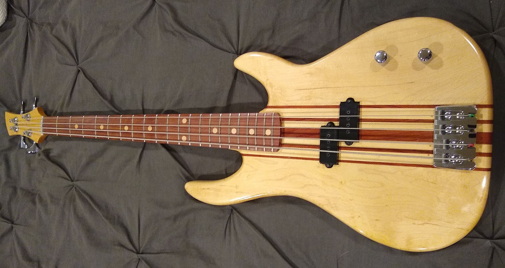

  
### Introduction

A few years ago, a friend of mine - who we'll call 'CalFrog' - challenged me to build a bass guitar.  The end result was the short-scale bass shown below.  Since then, I've made a couple more instruments and it seemed like it would be good to capture the process that goes into making something like this.

It should be said that this is how I do it, based on the tools I have available and the techniques that I'm comfortable with.  Clearly, there's more than one possible way to end up in a similar place, but I feel reasonably confident that I'll end up with something usable doing it this way.

### Decisions, decisions, decisions

